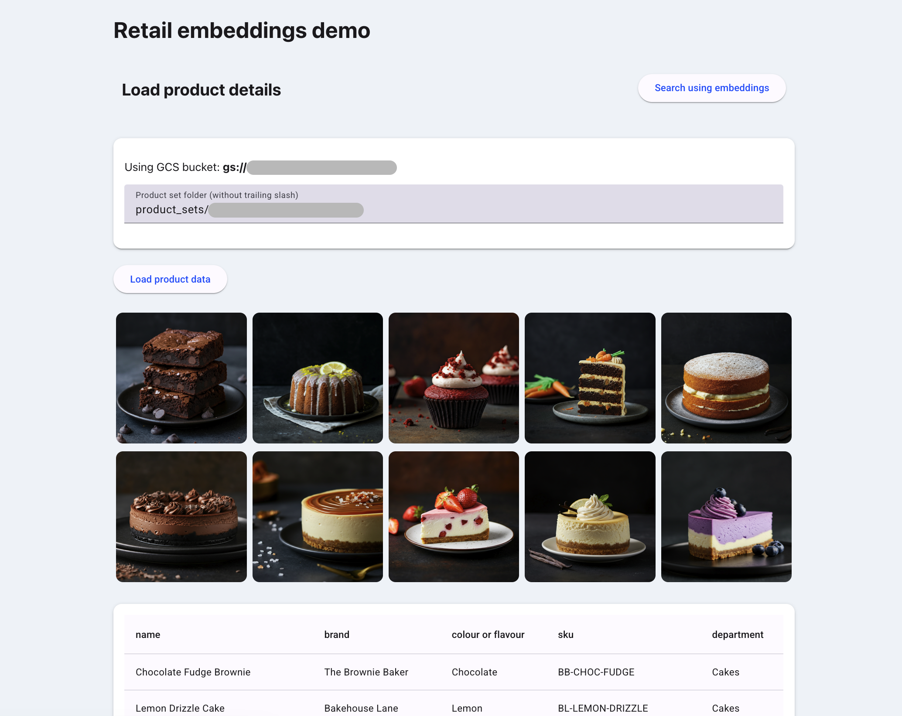
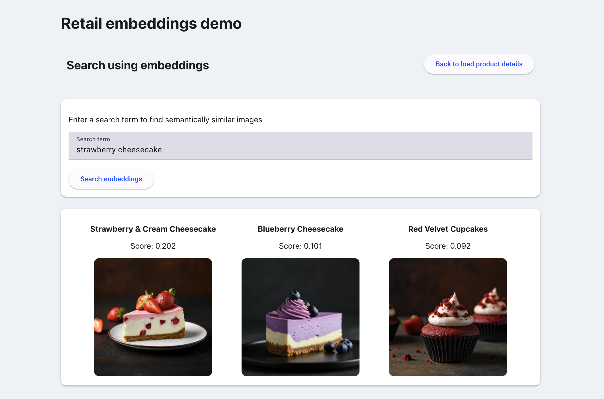

# Retail embeddings demo

See this Medium article for tips and tricks for getting started: [Make magic with Mesop: python based web apps](https://mandieq.medium.com/make-magic-with-mesop-python-based-web-apps-0fb60999b18d).

A simple demo app created using the [Mesop UI framework](https://github.com/google/mesop). 

The app does the following:
- loads product information from a given Google Cloud Storage bucket 
- allows the user to search the loaded product set using a text query based on semantics (using multimodal embeddings under the cover)

In reality this kind of search would be used under the covers to provide potential recommendations / similar products to users as part of a wider front end. This demo is intended to be very simple to illustrate the power of embeddings and also the Mesop UI. 😁

All product data was created using Google [Gemini 1.5 models](https://cloud.google.com/vertex-ai/generative-ai/docs/learn/models#gemini-models) (for text generation) and [Imagen 3 models](https://cloud.google.com/vertex-ai/generative-ai/docs/image/overview) (for image generation). Multimodal embeddings based on product images and names were created using the Google [multimodal embedding model](https://cloud.google.com/vertex-ai/generative-ai/docs/embeddings/get-multimodal-embeddings). 

## Screenshots

Load product data


Search product images & names using embeddings


## Running app locally 

Using the following command with mesop packages installed and using [Application Default Credentials](https://cloud.google.com/vertex-ai/docs/authentication#local-development) to authenticate to Vertex for API access. 

```
mesop retail_embedding.py
```

## Deployment

I tend to deploy to Google Cloud Run which allows a very simple [deploy from source code](https://cloud.google.com/run/docs/deploying-source-code) approach. But of course other options are available! 😊

See the [Mesop Deployment guide](https://google.github.io/mesop/guides/deployment/) for more details.